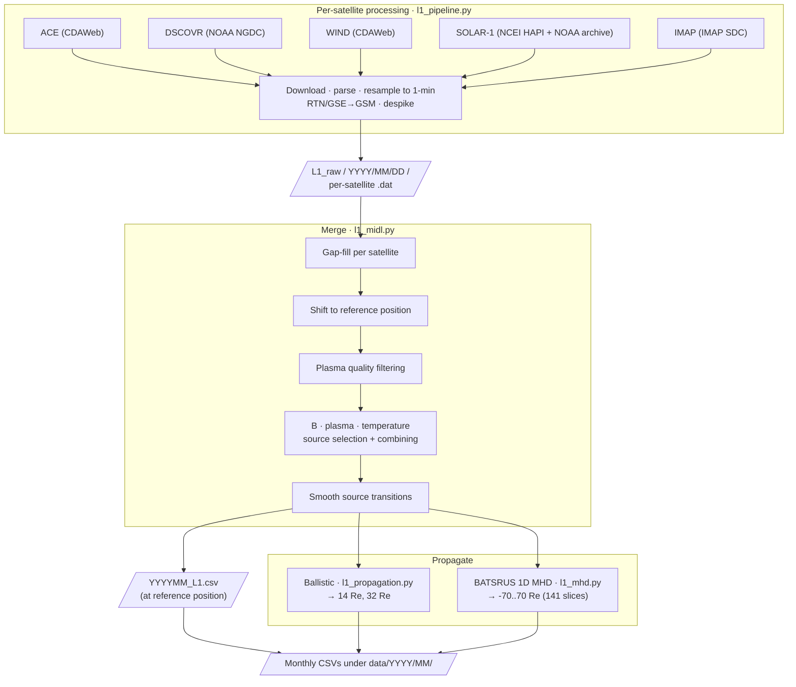

# Merged Interplanetary Data from L1 (MIDL)

Downloads, quality-screens, and combines 1-minute solar wind from **ACE**, **DSCOVR**, **WIND**, **SOLAR-1**, and **IMAP** into merged time series.

---

## Data Flow

Details of each stage live in the File Inventory and Methodology sections below.

---

## File Inventory

| File | Role |
|---|---|
| `l1_midl.py` | **Primary entry point**: `midl(start, end)` continuous pipeline, returns `MIDLResult` |
| `l1_writers.py` | Output formatters: `write_monthly_outputs()` (CSV) |
| `l1_plot.py` | Debugging plots: `plot_day()`, `plot_variable()` |
| `l1_pipeline.py` | Download, resample, coordinate rotation, and per-satellite raw `.dat` output |
| `l1_combine.py` | Source selection, satellite merging, and temperature combining logic |
| `l1_quality.py` | Quality checks and `score_all_plasma()` |
| `l1_filters.py` | `despike()`, `smooth_transitions()`, `median_filter_3()`, `interpolate_with_limits()` |
| `l1_propagation.py` | Ballistic travel-time propagation with causality enforcement |
| `l1_mhd.py` | 1D BATSRUS MHD propagation; returns an xarray Dataset on `(time, x)` spanning -70..70 Re |
| `l1_readers.py` | CDF, gzipped NetCDF, and HAPI CSV readers; ASCII `.dat` reader |
| `l1_downloaders.py` | CDAWeb, NOAA NGDC, and NCEI HAPI download helpers |

---

## Output Layout

### Monthly pipeline output

`data/YYYY/MM/`

| File | Description |
|---|---|
| `YYYYMM_L1.csv` | Merged stream at reference satellite position. Includes `X_Re` and source provenance columns (`B_source`, `Ux_source`, `Uyz_source`, `rho_source`, `T_source`). Source values are satellite codes: 1=ACE, 2=DSCOVR, 3=WIND, 4=SOLAR-1, 5=IMAP, concatenated (e.g. `13` = ACE+WIND, `34` = WIND+SOLAR-1). |
| `YYYYMM_14Re.csv` | Combined stream ballistically propagated to 14 Re |
| `YYYYMM_32Re.csv` | Combined stream ballistically propagated to 32 Re |
| `mhd/YYYYMM_mhd_<RRR>Re.csv` | 1D BATSRUS MHD solution at a single X slice, one file per integer Re from -70 to +70 (141 files per month). `<RRR>` is a 3-character zero-padded integer — e.g. `000Re`, `032Re`, `-70Re`. |

---

## Data Sources

| Satellite | Magnetometer | Plasma | Source |
|---|---|---|---|
| ACE | `AC_H0_MFI` (GSM) | `AC_H0_SWE` (GSM) | CDAWeb |
| DSCOVR | NGDC `m1m` (GSM) | NGDC `f1m` (GSM) | NOAA NGDC |
| WIND | `WI_H0_MFI` (GSM) | `WI_H1_SWE` (GSE → GSM) | CDAWeb |
| SOLAR-1 | `mag-l3_solar1` (GSM) | SWiPS L2 (GSM; Ux, rho, T only) | NOAA NCEI HAPI (mag), NOAA archive bucket (plasma) |
| IMAP | MAG L2 `norm-gsm` (GSM) | SWAPI L3a `proton-sw` (RTN → GSE → GSM) | IMAP Science Data Center |

DSCOVR plasma is taken from NOAA NGDC because the CDAWeb Faraday cup plasma product ends around 2019.

SOLAR-1 (SWFO-L1) magnetometer data is available from 2026-04-01 onward, SWiPS plasma from 2026-06-09 (provisional maturity). Only Ux, rho and T are used from SWiPS: checked against WIND, its Uz runs opposite to WIND's and its Uy carries a ~+22 km/s offset, so Uy/Uz are left NaN.

IMAP data is used from 2026-01-01 (both products lag real time by about two months). SWAPI's Sun-frame velocity already has orbital motion removed, matching the other sources. IMAP's position comes from SSCWeb.

> **Note:** GSE→GSM coordinate rotation uses spacepy's IGRF geomagnetic field model, which has a finite validity window (currently through 2030 with IGRF14). Processing certain dates requires updating spacepy to a version with newer IGRF coefficients.

---

## Methodology

Full algorithm description in the accompanying manuscript. For tunable parameters, see below.

---

## Tunable Parameters

- Quality thresholds: module-level constants in `l1_quality.py`
- Agreement thresholds (when satellites "agree"): `_switch_threshold()` in `l1_combine.py`
- Fallback hysteresis: `_SWITCH_MIN = 3` in `_select_column_with_continuity()` in `l1_combine.py`
- Transition smoothing: `_CMAX_DEFAULT`, `_WMAX_DEFAULT`, `_RATE_DEFAULT` in `l1_filters.py`
- Filter behavior: `despike()` in `l1_filters.py`
- Temperature combiner: `combine_temperature()` in `l1_combine.py`
- DSCOVR deprioritization: `_DSCOVR_DEPRIORITIZE_VARS` in `l1_combine.py` (default: rho, T)

---

## Data Access

- **Website:** [csem.engin.umich.edu/MIDL](https://csem.engin.umich.edu/MIDL/)
- **Python client:** [CSEM-MIDL](https://github.com/connordimarco/CSEM-MIDL) — `pip install csem-midl`

## See also

- **[MSWIM2D](https://csem.engin.umich.edu/MSWIM2D/)** — a 2-D MHD model of the
  solar wind from 1 to 75 AU that uses MIDL L1 data as its inner-boundary input.
  ([model code](https://github.com/connordimarco/MSWIM2D) ·
  [Python client `mswim2d`](https://github.com/connordimarco/CSEM-MSWIM2D))
